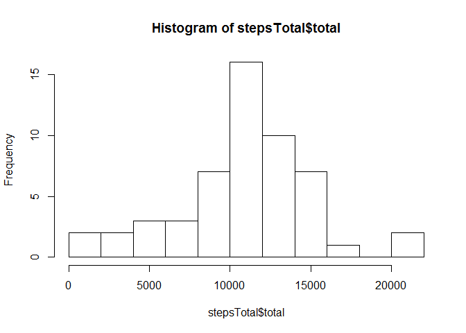
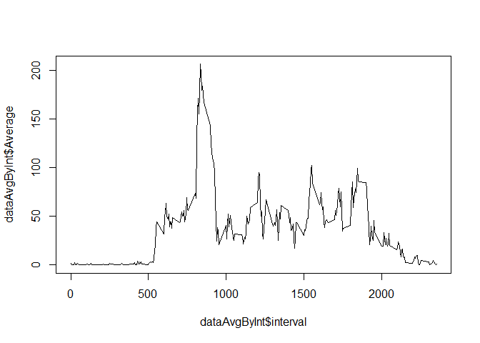
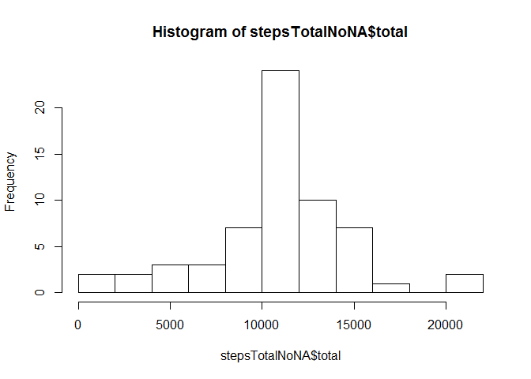
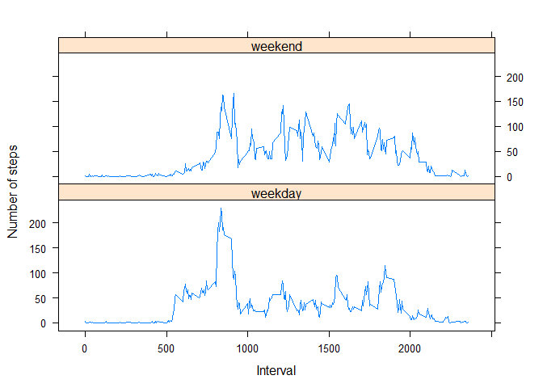

# Reproducible Research: Peer Assessment 1
Alejandro Gomez Salgado  
06/17/2015  


## Loading and preprocessing the data

Show any code that is needed to

1. Load the data (i.e. read.csv())


```r
  #We unzip data from repository and then we load it.
  zipData<-"activity.zip";
  unzip(zipData);
  data<-read.csv("activity.csv");
```

2. Process/transform the data (if necessary) into a format suitable for your analysis.

At this moment there is no need of transform or process data.

## What is mean total number of steps taken per day?

1. Calculate the total number of steps taken per day


```r
  #We calculate the total number of steps taken by day
  stepsTotal<-aggregate(data$steps,list(data$date),sum);
  names(stepsTotal)<-c("byDay","total");
  stepsTotal
```

```
##         byDay total
## 1  2012-10-01    NA
## 2  2012-10-02   126
## 3  2012-10-03 11352
## 4  2012-10-04 12116
## 5  2012-10-05 13294
## 6  2012-10-06 15420
## 7  2012-10-07 11015
## 8  2012-10-08    NA
## 9  2012-10-09 12811
## 10 2012-10-10  9900
## 11 2012-10-11 10304
## 12 2012-10-12 17382
## 13 2012-10-13 12426
## 14 2012-10-14 15098
## 15 2012-10-15 10139
## 16 2012-10-16 15084
## 17 2012-10-17 13452
## 18 2012-10-18 10056
## 19 2012-10-19 11829
## 20 2012-10-20 10395
## 21 2012-10-21  8821
## 22 2012-10-22 13460
## 23 2012-10-23  8918
## 24 2012-10-24  8355
## 25 2012-10-25  2492
## 26 2012-10-26  6778
## 27 2012-10-27 10119
## 28 2012-10-28 11458
## 29 2012-10-29  5018
## 30 2012-10-30  9819
## 31 2012-10-31 15414
## 32 2012-11-01    NA
## 33 2012-11-02 10600
## 34 2012-11-03 10571
## 35 2012-11-04    NA
## 36 2012-11-05 10439
## 37 2012-11-06  8334
## 38 2012-11-07 12883
## 39 2012-11-08  3219
## 40 2012-11-09    NA
## 41 2012-11-10    NA
## 42 2012-11-11 12608
## 43 2012-11-12 10765
## 44 2012-11-13  7336
## 45 2012-11-14    NA
## 46 2012-11-15    41
## 47 2012-11-16  5441
## 48 2012-11-17 14339
## 49 2012-11-18 15110
## 50 2012-11-19  8841
## 51 2012-11-20  4472
## 52 2012-11-21 12787
## 53 2012-11-22 20427
## 54 2012-11-23 21194
## 55 2012-11-24 14478
## 56 2012-11-25 11834
## 57 2012-11-26 11162
## 58 2012-11-27 13646
## 59 2012-11-28 10183
## 60 2012-11-29  7047
## 61 2012-11-30    NA
```
2. If you do not understand the difference between a histogram and a barplot, research the difference between them. Make a histogram of the total number of steps taken each day 


```r
  #Then we Make a histogram of the total number of steps taken each day.
  hist(stepsTotal$total,breaks = 10,);
```

 

3. Calculate and report the mean and median of the total number of steps taken per day.

Mean steps by day:

```r
  #We show the mean steps by day
  stepsMean<-aggregate(data$steps,list(data$date),mean);
  names(stepsMean)<-c("byDay","mean");
  stepsMean
```

```
##         byDay       mean
## 1  2012-10-01         NA
## 2  2012-10-02  0.4375000
## 3  2012-10-03 39.4166667
## 4  2012-10-04 42.0694444
## 5  2012-10-05 46.1597222
## 6  2012-10-06 53.5416667
## 7  2012-10-07 38.2465278
## 8  2012-10-08         NA
## 9  2012-10-09 44.4826389
## 10 2012-10-10 34.3750000
## 11 2012-10-11 35.7777778
## 12 2012-10-12 60.3541667
## 13 2012-10-13 43.1458333
## 14 2012-10-14 52.4236111
## 15 2012-10-15 35.2048611
## 16 2012-10-16 52.3750000
## 17 2012-10-17 46.7083333
## 18 2012-10-18 34.9166667
## 19 2012-10-19 41.0729167
## 20 2012-10-20 36.0937500
## 21 2012-10-21 30.6284722
## 22 2012-10-22 46.7361111
## 23 2012-10-23 30.9652778
## 24 2012-10-24 29.0104167
## 25 2012-10-25  8.6527778
## 26 2012-10-26 23.5347222
## 27 2012-10-27 35.1354167
## 28 2012-10-28 39.7847222
## 29 2012-10-29 17.4236111
## 30 2012-10-30 34.0937500
## 31 2012-10-31 53.5208333
## 32 2012-11-01         NA
## 33 2012-11-02 36.8055556
## 34 2012-11-03 36.7048611
## 35 2012-11-04         NA
## 36 2012-11-05 36.2465278
## 37 2012-11-06 28.9375000
## 38 2012-11-07 44.7326389
## 39 2012-11-08 11.1770833
## 40 2012-11-09         NA
## 41 2012-11-10         NA
## 42 2012-11-11 43.7777778
## 43 2012-11-12 37.3784722
## 44 2012-11-13 25.4722222
## 45 2012-11-14         NA
## 46 2012-11-15  0.1423611
## 47 2012-11-16 18.8923611
## 48 2012-11-17 49.7881944
## 49 2012-11-18 52.4652778
## 50 2012-11-19 30.6979167
## 51 2012-11-20 15.5277778
## 52 2012-11-21 44.3993056
## 53 2012-11-22 70.9270833
## 54 2012-11-23 73.5902778
## 55 2012-11-24 50.2708333
## 56 2012-11-25 41.0902778
## 57 2012-11-26 38.7569444
## 58 2012-11-27 47.3819444
## 59 2012-11-28 35.3576389
## 60 2012-11-29 24.4687500
## 61 2012-11-30         NA
```

Median steps by day:

```r
  #We show the median steps by day
  stepsMedian<-aggregate(data$steps,list(data$date),median);
  names(stepsMedian)<-c("byDay","median");
  stepsMedian
```

```
##         byDay median
## 1  2012-10-01     NA
## 2  2012-10-02      0
## 3  2012-10-03      0
## 4  2012-10-04      0
## 5  2012-10-05      0
## 6  2012-10-06      0
## 7  2012-10-07      0
## 8  2012-10-08     NA
## 9  2012-10-09      0
## 10 2012-10-10      0
## 11 2012-10-11      0
## 12 2012-10-12      0
## 13 2012-10-13      0
## 14 2012-10-14      0
## 15 2012-10-15      0
## 16 2012-10-16      0
## 17 2012-10-17      0
## 18 2012-10-18      0
## 19 2012-10-19      0
## 20 2012-10-20      0
## 21 2012-10-21      0
## 22 2012-10-22      0
## 23 2012-10-23      0
## 24 2012-10-24      0
## 25 2012-10-25      0
## 26 2012-10-26      0
## 27 2012-10-27      0
## 28 2012-10-28      0
## 29 2012-10-29      0
## 30 2012-10-30      0
## 31 2012-10-31      0
## 32 2012-11-01     NA
## 33 2012-11-02      0
## 34 2012-11-03      0
## 35 2012-11-04     NA
## 36 2012-11-05      0
## 37 2012-11-06      0
## 38 2012-11-07      0
## 39 2012-11-08      0
## 40 2012-11-09     NA
## 41 2012-11-10     NA
## 42 2012-11-11      0
## 43 2012-11-12      0
## 44 2012-11-13      0
## 45 2012-11-14     NA
## 46 2012-11-15      0
## 47 2012-11-16      0
## 48 2012-11-17      0
## 49 2012-11-18      0
## 50 2012-11-19      0
## 51 2012-11-20      0
## 52 2012-11-21      0
## 53 2012-11-22      0
## 54 2012-11-23      0
## 55 2012-11-24      0
## 56 2012-11-25      0
## 57 2012-11-26      0
## 58 2012-11-27      0
## 59 2012-11-28      0
## 60 2012-11-29      0
## 61 2012-11-30     NA
```

## What is the average daily activity pattern?

1. Make a time series plot (i.e. type = "l") of the 5-minute interval (x-axis) and the average number of steps taken, averaged across all days (y-axis)


```r
  #We need plyr library for nice aggregates methods
  library(plyr);
```

```
## Warning: package 'plyr' was built under R version 3.1.3
```

```r
  dataAvgByInt<-ddply(data, .(interval), summarize,  Average=mean(steps, na.rm = TRUE));
  plot(dataAvgByInt$Average~dataAvgByInt$interval,type="l")
```

 

```r
  maxInterval<-dataAvgByInt$interval[dataAvgByInt$Average == max(dataAvgByInt$Average)];
```

2. Which 5-minute interval, on average across all the days in the dataset, contains the maximum number of steps?
Result = 835

## Imputing missing values

Note that there are a number of days/intervals where there are missing values (coded as NA). The presence of missing days may introduce bias into some calculations or summaries of the data.

1. Calculate and report the total number of missing values in the dataset (i.e. the total number of rows with NAs).

```r
  naTotal<-sum(is.na(data$steps))
```
Result = 2304

2. Devise a strategy for filling in all of the missing values in the dataset. The strategy does not need to be sophisticated. For example, you could use the mean/median for that day, or the mean for that 5-minute interval, etc.

I used the mean for that 5-minute interval and filled in data$stepsNoNa


```r
  data$stepAvg <- ifelse(dataAvgByInt$interval==data$interval,dataAvgByInt$Average,0);
  data$stepsNoNA <- ifelse(is.na(data$steps),data$stepAvg,data$steps);
  summary(data)
```

```
##      steps                date          interval         stepAvg       
##  Min.   :  0.00   2012-10-01:  288   Min.   :   0.0   Min.   :  0.000  
##  1st Qu.:  0.00   2012-10-02:  288   1st Qu.: 588.8   1st Qu.:  2.486  
##  Median :  0.00   2012-10-03:  288   Median :1177.5   Median : 34.113  
##  Mean   : 37.38   2012-10-04:  288   Mean   :1177.5   Mean   : 37.383  
##  3rd Qu.: 12.00   2012-10-05:  288   3rd Qu.:1766.2   3rd Qu.: 52.835  
##  Max.   :806.00   2012-10-06:  288   Max.   :2355.0   Max.   :206.170  
##  NA's   :2304     (Other)   :15840                                     
##    stepsNoNA     
##  Min.   :  0.00  
##  1st Qu.:  0.00  
##  Median :  0.00  
##  Mean   : 37.38  
##  3rd Qu.: 27.00  
##  Max.   :806.00  
## 
```

3. Create a new dataset that is equal to the original dataset but with the missing data filled in.

**I just added data$stepsNoNA**

4. Make a histogram of the total number of steps taken each day and Calculate and report the mean and median total number of steps taken per day. Do these values differ from the estimates from the first part of the assignment? What is the impact of imputing missing data on the estimates of the total daily number of steps?

Total steps by day:

```r
  #We calculate the total number of steps taken by day
  stepsTotalNoNA<-aggregate(data$stepsNoNA,list(data$date),sum);
  names(stepsTotalNoNA)<-c("byDay","total");
  stepsTotalNoNA
```

```
##         byDay    total
## 1  2012-10-01 10766.19
## 2  2012-10-02   126.00
## 3  2012-10-03 11352.00
## 4  2012-10-04 12116.00
## 5  2012-10-05 13294.00
## 6  2012-10-06 15420.00
## 7  2012-10-07 11015.00
## 8  2012-10-08 10766.19
## 9  2012-10-09 12811.00
## 10 2012-10-10  9900.00
## 11 2012-10-11 10304.00
## 12 2012-10-12 17382.00
## 13 2012-10-13 12426.00
## 14 2012-10-14 15098.00
## 15 2012-10-15 10139.00
## 16 2012-10-16 15084.00
## 17 2012-10-17 13452.00
## 18 2012-10-18 10056.00
## 19 2012-10-19 11829.00
## 20 2012-10-20 10395.00
## 21 2012-10-21  8821.00
## 22 2012-10-22 13460.00
## 23 2012-10-23  8918.00
## 24 2012-10-24  8355.00
## 25 2012-10-25  2492.00
## 26 2012-10-26  6778.00
## 27 2012-10-27 10119.00
## 28 2012-10-28 11458.00
## 29 2012-10-29  5018.00
## 30 2012-10-30  9819.00
## 31 2012-10-31 15414.00
## 32 2012-11-01 10766.19
## 33 2012-11-02 10600.00
## 34 2012-11-03 10571.00
## 35 2012-11-04 10766.19
## 36 2012-11-05 10439.00
## 37 2012-11-06  8334.00
## 38 2012-11-07 12883.00
## 39 2012-11-08  3219.00
## 40 2012-11-09 10766.19
## 41 2012-11-10 10766.19
## 42 2012-11-11 12608.00
## 43 2012-11-12 10765.00
## 44 2012-11-13  7336.00
## 45 2012-11-14 10766.19
## 46 2012-11-15    41.00
## 47 2012-11-16  5441.00
## 48 2012-11-17 14339.00
## 49 2012-11-18 15110.00
## 50 2012-11-19  8841.00
## 51 2012-11-20  4472.00
## 52 2012-11-21 12787.00
## 53 2012-11-22 20427.00
## 54 2012-11-23 21194.00
## 55 2012-11-24 14478.00
## 56 2012-11-25 11834.00
## 57 2012-11-26 11162.00
## 58 2012-11-27 13646.00
## 59 2012-11-28 10183.00
## 60 2012-11-29  7047.00
## 61 2012-11-30 10766.19
```

and its correspondent histogram:

```r
  #Then we Make a histogram of the total number of steps taken each day.
  hist(stepsTotalNoNA$total,breaks = 10,);
```

 
Mean steps by day:

```r
  #We show the mean steps by day
  stepsMeanNoNA<-aggregate(data$stepsNoNA,list(data$date),mean);
  names(stepsMeanNoNA)<-c("byDay","mean");
  stepsMeanNoNA
```

```
##         byDay       mean
## 1  2012-10-01 37.3825996
## 2  2012-10-02  0.4375000
## 3  2012-10-03 39.4166667
## 4  2012-10-04 42.0694444
## 5  2012-10-05 46.1597222
## 6  2012-10-06 53.5416667
## 7  2012-10-07 38.2465278
## 8  2012-10-08 37.3825996
## 9  2012-10-09 44.4826389
## 10 2012-10-10 34.3750000
## 11 2012-10-11 35.7777778
## 12 2012-10-12 60.3541667
## 13 2012-10-13 43.1458333
## 14 2012-10-14 52.4236111
## 15 2012-10-15 35.2048611
## 16 2012-10-16 52.3750000
## 17 2012-10-17 46.7083333
## 18 2012-10-18 34.9166667
## 19 2012-10-19 41.0729167
## 20 2012-10-20 36.0937500
## 21 2012-10-21 30.6284722
## 22 2012-10-22 46.7361111
## 23 2012-10-23 30.9652778
## 24 2012-10-24 29.0104167
## 25 2012-10-25  8.6527778
## 26 2012-10-26 23.5347222
## 27 2012-10-27 35.1354167
## 28 2012-10-28 39.7847222
## 29 2012-10-29 17.4236111
## 30 2012-10-30 34.0937500
## 31 2012-10-31 53.5208333
## 32 2012-11-01 37.3825996
## 33 2012-11-02 36.8055556
## 34 2012-11-03 36.7048611
## 35 2012-11-04 37.3825996
## 36 2012-11-05 36.2465278
## 37 2012-11-06 28.9375000
## 38 2012-11-07 44.7326389
## 39 2012-11-08 11.1770833
## 40 2012-11-09 37.3825996
## 41 2012-11-10 37.3825996
## 42 2012-11-11 43.7777778
## 43 2012-11-12 37.3784722
## 44 2012-11-13 25.4722222
## 45 2012-11-14 37.3825996
## 46 2012-11-15  0.1423611
## 47 2012-11-16 18.8923611
## 48 2012-11-17 49.7881944
## 49 2012-11-18 52.4652778
## 50 2012-11-19 30.6979167
## 51 2012-11-20 15.5277778
## 52 2012-11-21 44.3993056
## 53 2012-11-22 70.9270833
## 54 2012-11-23 73.5902778
## 55 2012-11-24 50.2708333
## 56 2012-11-25 41.0902778
## 57 2012-11-26 38.7569444
## 58 2012-11-27 47.3819444
## 59 2012-11-28 35.3576389
## 60 2012-11-29 24.4687500
## 61 2012-11-30 37.3825996
```

Median steps by day:

```r
  #We show the median steps by day
  stepsMedianNoNA<-aggregate(data$stepsNoNA,list(data$date),median);
  names(stepsMedianNoNA)<-c("byDay","median");
  stepsMedianNoNA
```

```
##         byDay   median
## 1  2012-10-01 34.11321
## 2  2012-10-02  0.00000
## 3  2012-10-03  0.00000
## 4  2012-10-04  0.00000
## 5  2012-10-05  0.00000
## 6  2012-10-06  0.00000
## 7  2012-10-07  0.00000
## 8  2012-10-08 34.11321
## 9  2012-10-09  0.00000
## 10 2012-10-10  0.00000
## 11 2012-10-11  0.00000
## 12 2012-10-12  0.00000
## 13 2012-10-13  0.00000
## 14 2012-10-14  0.00000
## 15 2012-10-15  0.00000
## 16 2012-10-16  0.00000
## 17 2012-10-17  0.00000
## 18 2012-10-18  0.00000
## 19 2012-10-19  0.00000
## 20 2012-10-20  0.00000
## 21 2012-10-21  0.00000
## 22 2012-10-22  0.00000
## 23 2012-10-23  0.00000
## 24 2012-10-24  0.00000
## 25 2012-10-25  0.00000
## 26 2012-10-26  0.00000
## 27 2012-10-27  0.00000
## 28 2012-10-28  0.00000
## 29 2012-10-29  0.00000
## 30 2012-10-30  0.00000
## 31 2012-10-31  0.00000
## 32 2012-11-01 34.11321
## 33 2012-11-02  0.00000
## 34 2012-11-03  0.00000
## 35 2012-11-04 34.11321
## 36 2012-11-05  0.00000
## 37 2012-11-06  0.00000
## 38 2012-11-07  0.00000
## 39 2012-11-08  0.00000
## 40 2012-11-09 34.11321
## 41 2012-11-10 34.11321
## 42 2012-11-11  0.00000
## 43 2012-11-12  0.00000
## 44 2012-11-13  0.00000
## 45 2012-11-14 34.11321
## 46 2012-11-15  0.00000
## 47 2012-11-16  0.00000
## 48 2012-11-17  0.00000
## 49 2012-11-18  0.00000
## 50 2012-11-19  0.00000
## 51 2012-11-20  0.00000
## 52 2012-11-21  0.00000
## 53 2012-11-22  0.00000
## 54 2012-11-23  0.00000
## 55 2012-11-24  0.00000
## 56 2012-11-25  0.00000
## 57 2012-11-26  0.00000
## 58 2012-11-27  0.00000
## 59 2012-11-28  0.00000
## 60 2012-11-29  0.00000
## 61 2012-11-30 34.11321
```

As you can see the impact is obvious in the median, but no in the mean, perhaps It would had been better to use the median instead of the mean(average) when substitute the NA values.

## Are there differences in activity patterns between weekdays and weekends?

For this part the weekdays() function may be of some help here. Use the dataset with the filled-in missing values for this part.

1. Create a new factor variable in the dataset with two levels - "weekday" and "weekend" indicating whether a given date is a weekday or weekend day.


```r
  #We create the new factor with the values weekend and weekday
  data$day<-ifelse(weekdays(as.Date(data$date),abbreviate = TRUE) %in% c("Sat","Sun"),"weekend","weekday");
  table(data$day)
```

```
## 
## weekday weekend 
##   12960    4608
```


```r
  #We process data
  datawk<-ddply(data, .(interval,day), summarize,  Average=mean(stepsNoNA, na.rm = TRUE));
  #We load lattice
  library(lattice)
  xyplot( datawk$Average~datawk$interval | datawk$day, type ="l" , layout=c(1,2),xlab = "Interval", ylab = "Number of steps");
```

 
